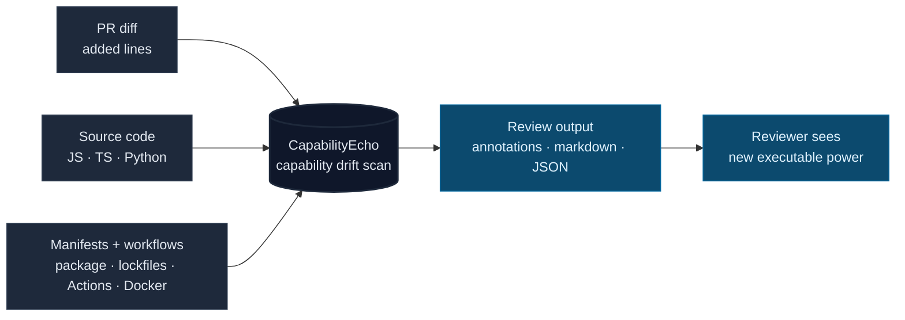

# CapabilityEcho

[](LICENSE)
[](package.json)
[](#how-it-works)
[](https://github.com/Conalh/CapabilityEcho/releases)

**A code-diff capability detector for AI-agent pull requests.** CapabilityEcho flags new network, subprocess, eval, lifecycle, dependency, Dockerfile, and workflow-permission signals introduced by the code itself, not the agent config.

Agent config can stay unchanged while the diff adds a `fetch('https://...')`, a `postinstall` script, a `contents: write` workflow, or a subprocess path that makes the agent's output more powerful than the task implied. CapabilityEcho makes that executable capability drift visible on the exact added lines.



**See also:** [ScopeTrail](https://github.com/Conalh/ScopeTrail) for config drift · [TaskBound](https://github.com/Conalh/TaskBound) for task-vs-diff scope creep · [GovVerdict](https://github.com/Conalh/GovVerdict) for one merged suite verdict.

## Why this exists

A PR does not need to edit `.mcp.json` or `.claude/settings.json` to expand what an agent-produced change can do. It can add network calls, subprocess execution, lifecycle scripts, workflow permissions, or high-capability dependencies directly in code.

CapabilityEcho exists to make those new executable capabilities reviewable. It does not decide whether a capability is always bad; it points reviewers to the exact line where the diff gained new power.

## What it catches

| Drift class | Example |
| --- | --- |
| **Network capability** | Added `fetch`, HTTP clients, workflow `curl`, or networky npm scripts. |
| **Subprocess capability** | Added shell/process execution, dynamic command construction, or shell pipelines. |
| **Lifecycle capability** | `postinstall`, publish scripts, pipe-to-shell installers, or package hooks. |
| **Workflow capability** | New write permissions, external requests, secret exposure patterns, risky PR-target flows. |
| **Dependency capability** | New high-capability packages or lockfile changes that introduce sensitive behavior. |

## How well it catches it

The thing that separates a linter from a tool you can gate CI on is a labeled
precision/recall number. CapabilityEcho ships one: a corpus of 34 before/after PR
snapshots — 20 rogue (a new capability quietly added) and 14 benign adversarial
near-misses (same-origin `fetch`, `yaml.safe_load`, ordinary dep adds, refactors)
— scored against ground-truth labels written from intent, independent of what the
tool emits.

| Metric | Value |
| --- | --- |
| Cases | 34 (20 rogue, 14 benign) |
| Detection recall (any finding) | 100.0% |
| False-positive rate (benign flagged) | 0.0% |
| Precision | 100.0% |
| Recall at `--fail-on=high` CI gate | 85.0% |
| Correct primary capability identified | 20/20 |

Every rogue case is detected and every benign near-miss stays quiet. The 85% at a
`high` gate is calibration, not a miss: three rogue cases (an external `fetch`, a
Python `requests.get`, a `wget` download) are genuinely *medium*-severity — gate on
`medium` to fail CI on every rogue case in the corpus.

Reproduce with `npm run benchmark`. Methodology and the full corpus live in
[`benchmark/`](benchmark/README.md); the regenerated report is
[`benchmark/RESULTS.md`](benchmark/RESULTS.md).

## Quickstart

### As a GitHub Action (most common)

```yaml
name: CapabilityEcho
on: pull_request
permissions:
  contents: read

jobs:
  capabilityecho:
    runs-on: ubuntu-latest
    steps:
      - uses: actions/checkout@v6
        with:
          fetch-depth: 0          # required: PR base + head are compared
      - uses: Conalh/CapabilityEcho@v0.3.2
        with:
          fail-on: none           # start advisory, raise to high/critical later
```

This writes a Markdown report to the Actions step summary and emits PR-visible `::warning` annotations on the risky lines.

### Local CLI

```powershell
git clone https://github.com/Conalh/CapabilityEcho
cd CapabilityEcho
npm install
npm run build

# Compare two directories (fastest way to try it on the bundled fixture)
node dist/index.js diff `
  --old test/fixtures/capability-drift/old `
  --new test/fixtures/capability-drift/new `
  --format markdown

# Compare two git refs in a real repo
node dist/index.js diff --repo . --base main --head HEAD --format text
```

## Example output

Real output from the bundled fixture, `--format text`:

```
CapabilityEcho capability drift: CRITICAL
Scanned executable surfaces: source code, package manifests, GitHub workflows.
Excluded surfaces: AI-agent config.
Signals: GitHub Actions workflow-level write permissions, workflow external network requests,
  external network fetch calls, npm lifecycle scripts, pipe-to-shell install scripts,
  network or publish npm scripts
Top recommendations: Replace remote pipe-to-shell patterns with pinned, reviewable install steps.
  | Use the narrowest permission scope required for this job.
  | Review lifecycle scripts carefully; they run automatically on install.
[HIGH]     GitHub Actions workflow-level write permission (contents) — contents:write applies to every job
[MEDIUM]   Workflow external request — step performs an external network request
[MEDIUM]   External network fetch — added code performs an external HTTP request
[HIGH]     package.json postinstall script — added or changed npm lifecycle script
[CRITICAL] package.json postinstall pipe-to-shell — script pipes remote content into a shell
[MEDIUM]   package.json postinstall network command
```

`--format json` emits the canonical [agent-gov-core](https://github.com/Conalh/agent-gov-core) `Report` envelope — the same shape every tool in the suite emits, so [GovVerdict](https://github.com/Conalh/GovVerdict) can merge them:

```json
{
  "schemaVersion": "1.0",
  "tool": "capability_echo",
  "rating": "critical",
  "findings": [
    {
      "tool": "capability_echo",
      "kind": "capability_echo.script_pipe_to_shell",
      "severity": "critical",
      "message": "Script downloads and pipes content directly into a shell.",
      "location": { "file": "package.json", "line": 12 },
      "salientKey": "package.json postinstall pipe-to-shell",
      "data": {
        "subject": "package.json postinstall pipe-to-shell",
        "recommendation": "Replace remote pipe-to-shell patterns with pinned, reviewable install steps.",
        "surface": "package"
      },
      "fingerprint": "..."
    }
  ],
  "data": { "changedFileCount": 3, "scannedSurfaces": ["source", "package", "workflow"] }
}
```

## How it works

- Runs against the **checked-out repo** — no upload, no hosted scanner, no telemetry.
- Resolves the diff (`--old`/`--new` directories, or `--base`/`--head` git refs) and inspects **added lines** across source code, package manifests + lockfiles, GitHub workflows, and Dockerfiles.
- Fires small, explicit detectors for patterns that expand capability: external network calls, subprocess/shell spawns, dynamic `eval`/`exec`, unsafe deserialization, high-capability deps, npm lifecycle and pipe-to-shell scripts, workflow write permissions and external requests, secret-tainted exfil patterns.
- Workflows get a structural YAML pass backed by a line pass for shell text inside `run:` blocks.
- Findings carry severity, file + line, and a recommendation. The action exits non-zero only when `fail-on` is met.

CapabilityEcho does **not** scan agent config files like `.mcp.json` or `.claude/settings.json`; that is [ScopeTrail](https://github.com/Conalh/ScopeTrail)'s lane. The two are designed to run together.

## Design choices worth flagging

- **Code, not config.** The tool catches capabilities introduced by executable artifacts even when the agent policy surface did not change.
- **Added-line bias.** Findings stay tied to what the PR introduced, which keeps review focused on the current change.
- **Small detectors.** The scanner is intentionally explicit and explainable instead of pretending to be a full semantic security engine.
- **Suite-shaped output.** JSON uses the shared `Finding` contract so GovVerdict can merge it with the rest of the agent-gov tools.

## Options

### CLI flags (`capabilityecho diff ...`)

| Flag | Default | Purpose |
| --- | --- | --- |
| `--old <dir>` / `--new <dir>` | — | Directory-mode diff. |
| `--repo <path>` / `--base <ref>` / `--head <ref>` | repo = cwd | Git-mode diff between two refs in a real repo. |
| `--format` | `text` | `text`, `markdown`, `json` (canonical envelope), `github` (annotations). |
| `--fail-on` | `none` | Exit non-zero if the highest finding meets this severity: `none`, `low`, `medium`, `high`, `critical`. |

### GitHub Action inputs

| Input | Default | Purpose |
| --- | --- | --- |
| `repo` | `$GITHUB_WORKSPACE` | Checkout path to inspect. |
| `base` / `head` | PR base / head | Override the refs being compared. |
| `fail-on` | `none` | Severity that fails the job. |
| `max-findings` | `0` (unlimited) | Truncate Action outputs + step summary to top-N by severity. Rating and `fail-on` still use the full set. |
| `max-output-bytes` | `0` (unlimited) | Suppress `report-markdown` / `report-json` Action outputs over this size (step summary kept). |
| `report-file` | _empty_ | Path to write the full Markdown report (plus a sibling `.json`). Pair with `actions/upload-artifact`. |

### GitHub Action outputs

`rating`, `has-findings`, `finding-count`, `changed-file-count`, `surface-summary`, `severity-summary`, `capability-summary`, `top-recommendations`, `adoption-evidence`, `report-markdown`, `report-json`.

## Part of the agent-gov suite

Local-only OSS tools that review AI-agent PRs and coding sessions for config drift, policy mismatches, and scope creep. Each tool covers an orthogonal failure mode; they share a canonical `Finding` schema and can be merged into a single verdict.

| Repo | What it catches |
| --- | --- |
| [ScopeTrail](https://github.com/Conalh/ScopeTrail) | Agent config drift between PR base and head. |
| [PolicyMesh](https://github.com/Conalh/PolicyMesh) | Contradictory agent instructions and config drift that make behavior non-reproducible. |
| **CapabilityEcho** *(this repo)* | Capability drift introduced by code, manifests, workflows, and Dockerfiles. |
| [TaskBound](https://github.com/Conalh/TaskBound) | Scope creep between the stated task and the actual diff. |
| [SessionTrail](https://github.com/Conalh/SessionTrail) | Risky runtime behavior in Cursor / Claude Code / Codex session transcripts. |
| [GovVerdict](https://github.com/Conalh/GovVerdict) | Merges JSON reports from the tools above into one deduped review. |
| [agent-gov-core](https://github.com/Conalh/agent-gov-core) | Shared parsers, the canonical `Finding` schema, and `mergeFindings`. |
| [agent-gov-demo](https://github.com/Conalh/agent-gov-demo) | Demo sandbox with a rogue PR that fires all five reviewers. |

MIT. Bug reports and false-positive reports welcome via [Issues](https://github.com/Conalh/CapabilityEcho/issues).
